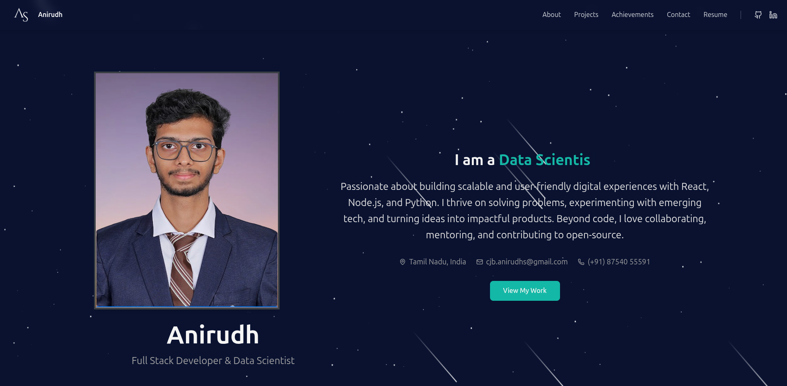

# Anirudh's Portfolio

Welcome to my portfolio! This website showcases my projects, skills, and achievements as a developer.

## Features
- Smooth scrolling navigation
- Contact form with validation
- Showcase of featured projects
- Achievements section
- Resume download functionality

## Technologies Used
- React
- Tailwind CSS

## Getting Started

To get a local copy up and running follow these simple steps.

### Prerequisites
- Node.js
- npm

### Installation
1. Clone the repo
   ```bash
   git clone https://github.com/username/my-portfolio.git
   ```
2. Install NPM packages
   ```bash
   npm install
   ```

### Usage
To run the project, execute:
```bash
npm start
```
This will start the development server and open the app in your browser at [http://localhost:3000](http://localhost:3000).

### Build CSS
To build the CSS with Tailwind, run:
```bash
npm run build:css
```

## Demo


## Contact
For inquiries, please reach out to me at:
- Email: cjb.anirudhs@gmail.com
- Phone: (+91) 87540 55591
